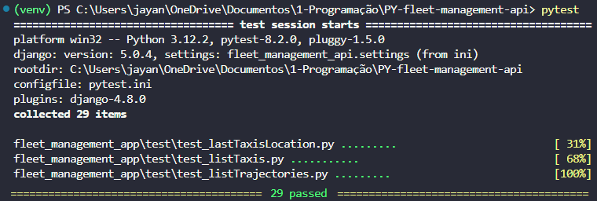

# Fleet Management - Software de Gestão de Frota API - Python 🐍

## Índice

* [1. Prefácio](#1-prefácio)
* [2. Resumo do projeto](#2-resumo-do-projeto)
* [3. Recursos Principais](#3-recursos-principais)
* [4. Guia Prático de Instalação e Uso](#4-guia-prático-de-instalação-e-uso)
* [5. Testes Unitários](#5-testes-unitários)
* [6. Critérios Mínimos de Aceitação](#6-critérios-mínimos-de-aceitação)
* [7. Especificações Técnicas](#7-especificações-técnicas)
* [8. Implementações Futuras](#8-implementações-futuras)
* [9. Desenvolvedor](#9-desenvolvedor)

***

## 1. Prefácio

Este projeto foi desenvolvido como parte do programa prático intensivo de Python da Laboratoria, que visa preparar desenvolvedoras para os desafios do mercado de trabalho em tecnologia. Durante o curso, os participantes têm a oportunidade de aplicar conceitos teóricos em projetos práticos, desenvolvendo habilidades técnicas e adquirindo experiência na construção de soluções reais. Este projeto, em particular, representa uma etapa significativa desse processo, focando na aplicação de conceitos de Internet das Coisas (IoT) e desenvolvimento de APIs RESTful.

## 2. Resumo do projeto

O projeto consiste na criação de uma API REST de um [Software de Gestão de Frota](https://en.wikipedia.org/wiki/Fleet_management) para uma empresa de táxis em Pequim, China. A API permite consultar as localizações de quase 10 mil táxis em tempo real, utilizando dados gerados por dispositivos IoT. Os principais desafios enfrentados foram o armazenamento, a análise e a visualização de grandes volumes de dados. O projeto reflete o uso de técnicas avançadas de desenvolvimento e serve como um exemplo concreto do aprendizado adquirido durante o programa de Python da Laboratoria.

### Principais Características:

* **Consulta de Dados:** A API permite consultar listas de táxis, trajetórias e localizações.
* **Paginação Personalizável:** Configure o número de itens por página e navegue facilmente pelos resultados.
* **Ordenação Avançada:** Ordene os dados por diferentes critérios, como ID, placa, data, latitude e longitude.
* **Filtros e Pesquisa:** Filtre os resultados por dados específicos dos táxis e pesquise termos abrangentes nos registros.

## 3. Recursos Principais

#### Consulta de Táxis:

* **Lista de Todos os Táxis:** Consulte a lista completa de táxis cadastrados na plataforma.
* **Última Localização:** Acesse a última localização registrada de cada táxi.

#### Consulta de Trajetórias:

* **Lista Completa:** Obtenha a lista de todas as trajetórias realizadas pelos táxis.

#### Paginação e Ordenação:

* **Número da Página:** Use `?page=` para definir o número da página que deseja visualizar.
* **Tamanho da Página:** Utilize `?page_size=` para definir a quantidade de objetos exibidos por página.
* **Ordenação por ID Externo e Interno:** Organize os resultados de forma ascendente ou descendente de acordo com o ID externo ou dados internos dos táxis (como ID e placa).
    - Ordene por ID externo de forma ascendente com `?sort_by=id` ou de forma descendente com `?sort_by=-id`.
    - Ordene por ID interno de forma ascendente com `?sort_by=taxi__id` e por placa com `?sort_by=taxi__plate`.
    - Ordene de forma descendente por ID interno com `?sort_by=-taxi__id` e por placa com `?sort_by=-taxi__plate`.
* **Ordenação por Data e Localização:** Organize os dados de forma ascendente ou descendente por data, latitude e longitude.
    - Ordene por data, latitude e longitude de forma ascendente com `?sort_by=date`, `?sort_by=latitude`, e `?sort_by=longitude`.
    - Ordene de forma descendente com `?sort_by=-date`, `?sort_by=-latitude`, e `?sort_by=-longitude`.

#### Filtros e Pesquisa Avançada:

* **Filtragem:** Aplique filtros baseados em dados internos dos táxis, como ID e placa, utilizando `?filter_by=`.
* **Pesquisa de Termos:** Realize buscas abrangentes por termos específicos em todos os campos de dados com `?search=`.

## 4. Guia Prático de Instalação e Uso

## 5. Testes Unitários

Foram implementados testes unitários para os endpoints listTaxis, listTrajectories e lastTaxisLocation, cobrindo as funcionalidades de listagem de todos os táxis, trajetórias, e última localização de cada táxi. Além disso, os testes verificaram as funcionalidades de paginação, ordenação, filtragem e busca. Todos os testes foram executados com sucesso, confirmando que as funcionalidades implementadas estão operando conforme o esperado.

## 6. Critérios Mínimos de Aceitação

Nossa cliente instalou dispositivos GPS em seus táxis. Esses dispositivos
usam sinais de satélite para determinar com precisão as coordenadas
geográficas do táxi.

Nossa cliente requer:

1. Carregar as informações dos arquivos SQL para um banco de dados
PostgreSQL.
2. Desenvolver uma API REST que permita consultar, por meio de requisições
HTTP, as informações armazenadas no banco de dados.

### Definição do produto

O [_Product Owner_](https://www.youtube.com/watch?v=r2hU7MVIzxs&t=202s)
nos apresenta este _backlog_ que é o resultado de seu trabalho com a
cliente até hoje.

***

#### [História do usuário 1] Carregar informações no banco de dados

Eu, como desenvolvedora, quero carregar as informações armazenadas até
agora em
[arquivos SQL](https://drive.google.com/file/d/1T5m6Vzl9hbD75E9fGnjbOiG2UYINSmLx/view?usp=drive_link)
em um banco de dados PostgreSQL, para facilitar sua consulta e análise.

##### Critérios de aceitação

* Deve-se considerar o seguinte diagrama para a implementação das
relações entre as tabelas

* A tabela de _trajectories_ deve ser criada com o "id" que aumenta
automaticamente (SERIAL) para poder inserir os valores sem a necessidade de
especificar um identificador.

##### Definição de pronto

* O banco de dados tem a tabela de táxis criada.
* A tabela de táxis tem os dados dos táxis carregados.
* O banco de dados tem a tabela de trajetórias criada.
* A tabela de trajetórias tem os dados das trajetórias dos táxis carregados.

***

##### [História do usuário 2] Endpoint de listagem de táxis

Eu, como cliente da API REST, necessito de um _endpoint_ para listar
todos os táxis.

##### Critérios de aceitação

* O _endpoint_ responde para cada táxi: id e placa.
* O _endpoint_ paginamos os resultados para garantir que as respostas
sejam mais fáceis de manejar.

##### Definição de pronto

* Há documentação no [Swagger](https://swagger.io/) para o _endpoint_
desenvolvido, especificando
[método HTTP](https://developer.mozilla.org/en-US/docs/Web/HTTP/Methods),
url, parâmetros,
[cabeçalhos](https://developer.mozilla.org/en-US/docs/Web/HTTP/Headers),
[códigos HTTP de resposta](https://shorturl.at/bdegB) e corpo.
* O código do _endpoint_ deve passar por revisão de código de pelo menos uma colega.
* O código do _endpoint_ deve ser carregado em um repositório do Github.
* O código do _endpoint_ deve ter testes unitários e de ponta a ponta.

***

#### [História do usuário 3] Endpoint de histórico de localizações

Eu, como cliente da API REST, necessito de um _endpoint_ para consultar
todas as localizações de um táxi dado o id do táxi e uma data.

##### Critérios de aceitação

* O _endpoint_ responde para o id do táxi e uma data consultado as
  seguintes informações: latitude, longitude e timestamp (data e hora).
* O _endpoint_ paginamos os resultados para garantir que as respostas sejam
mais fáceis de manejar.

##### Definição de pronto

* Há documentação no [Swagger](https://swagger.io/) para o _endpoint_
desenvolvido, especificando
[método HTTP](https://developer.mozilla.org/en-US/docs/Web/HTTP/Methods),
url, parâmetros,
[cabeçalhos](https://developer.mozilla.org/en-US/docs/Web/HTTP/Headers),
[códigos HTTP de resposta](https://shorturl.at/bdegB) e corpo.
* O código do _endpoint_ deve passar por revisão de código de pelo menos uma colega.
* O código do _endpoint_ deve ser carregado em um repositório do Github.
* O código do _endpoint_ deve ter testes unitários e de ponta a ponta.

***

#### [História do usuário 4] Endpoint de última localização

Eu, como cliente da API REST, necessito de um _endpoint_ para consultar a
última localização reportada por cada táxi.

##### Critérios de aceitação

* O _endpoint_ responde para cada táxi as seguintes informações: id, placa,
latitude, longitude e timestamp (data e hora).
* O _endpoint_ paginamos os resultados para garantir que as respostas sejam
mais fáceis de manejar.

##### Definição de pronto

* Há documentação no [Swagger](https://swagger.io/) para o _endpoint_
desenvolvido, especificando
[método HTTP](https://developer.mozilla.org/en-US/docs/Web/HTTP/Methods),
url, parâmetros,
[cabeçalhos](https://developer.mozilla.org/en-US/docs/Web/HTTP/Headers),
[códigos HTTP de resposta](https://shorturl.at/bdegB) e corpo.
* O código do _endpoint_ deve passar por revisão de código de pelo menos uma colega.
* O código do _endpoint_ deve ser carregado em um repositório do Github.
* O código do _endpoint_ deve ter testes unitários e de ponta a ponta.

***

## 7. Especificações Técnicas

O projeto foi desenvolvido utilizando como ferramentas e tecnologias:

* Python
* Django REST framework
* PyTest
* Unittest.mock 
* GitHub
* Git Bash
* Trello

## 8. Implementações Futuras

#### Otimização de Tempos de Resposta:

* Criar índices na tabela de localizações para melhorar a velocidade das consultas.
* Implementar um esquema de particionamento na tabela de localizações para distribuir a carga e acelerar o processamento.
* Consultar e visualizar dados progressivamente em lotes para reduzir o tempo de resposta percebido pelo usuário.

#### Endpoint para Exportação em Excel:

* Adicionar um endpoint que permita a exportação das localizações de um veículo em uma data específica para um arquivo Excel.
* Otimizar o processo de geração e download de arquivos Excel para garantir desempenho eficiente mesmo com grandes volumes de dados.

#### Implementação de um CRUD Completo:

* Adicionar suporte às operações POST, PUT e DELETE na API para permitir a criação, atualização e remoção de registros, complementando as funcionalidades de consulta atualmente implementadas.

## 9. Desenvolvedor

Jayanny Santana

* GitHub: [@jay-santana](https://github.com/jay-santana)
* Linkedin: [Jayanny Santana](https://www.linkedin.com/in/jayanny-santana/)

